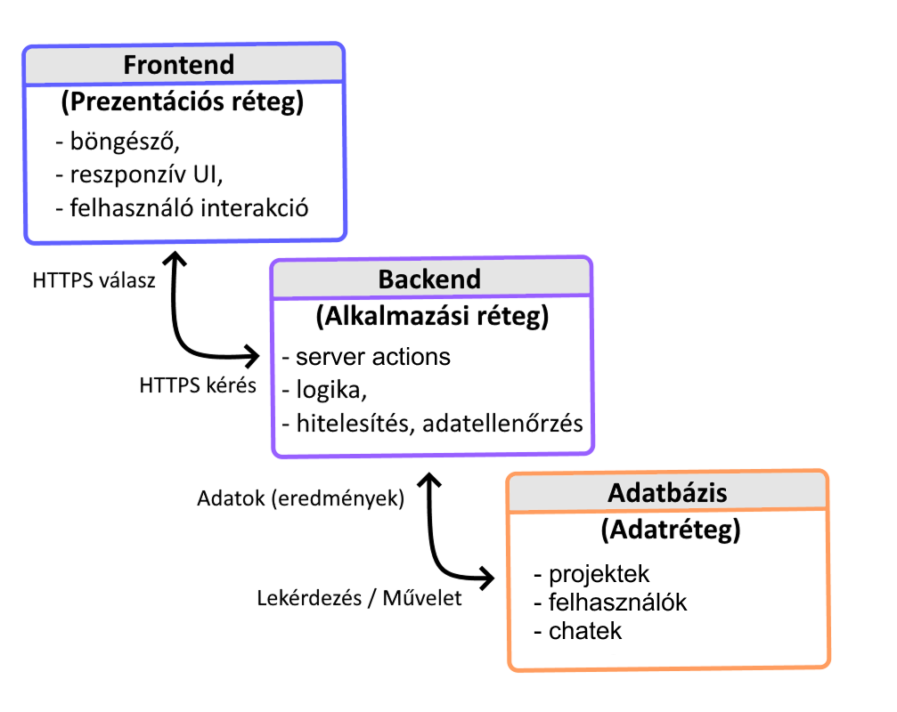
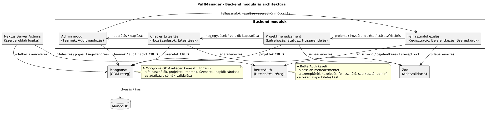

# PuffManager – Rendszerterv

## 1. Bevezetés

A **PuffManager** egy webalapú projektmenedzsment rendszer, amely a **PuffContent** videóvágó ügynökség és ügyfelei közötti együttműködést támogatja.  
A cél a videóvágási projektek teljes életciklusának digitalizálása, az igénybejelentéstől a kész anyag jóváhagyásáig.

A rendszer fő funkciói:
- Projektek létrehozása, státuszkezelése és megjelenítése Kanban táblán.  
- Valós idejű kommunikáció ügyfelek és vágók között projektalapú chatfelületen.  
- Automatikus értesítések státuszváltozásról és üzenetekről.  
- Admin funkciók a felhasználók, teamek és projektek kezelésére.  

A PuffManager célja, hogy a korábbi manuális, e-mail alapú folyamatokat digitálisan, automatizált módon váltsa ki, minimalizálva a hibalehetőségeket és növelve az átláthatóságot.  

A fejlesztés fő szempontjai: **biztonság**, **megbízhatóság**, **reszponzív működés**, **skálázhatóság** és **jövőbeli bővíthetőség**.

 

## 2. Architektúra és rendszerkomponensek

### 2.1 Áttekintés
A **PuffManager** háromrétegű architektúrára épül:
- **Prezentációs réteg (frontend)** – a felhasználói böngészőben futó, reszponzív webes felület, amely megjeleníti a projekteket, státuszokat és a kommunikációt.  
- **Alkalmazási réteg (backend)** – a szerveroldali logika, amely feldolgozza a felhasználói műveleteket, kezeli a hitelesítést és kapcsolatot tart az adatbázissal.  
- **Adatréteg (adatbázis)** – a projektek, felhasználók, teamek és üzenetek tárolásáért felelős dokumentum-alapú adatbázis (MongoDB).  

 

---

### 2.2 Frontend
A **kliensoldali komponens** a felhasználói élményért és az interaktív funkciókért felelős.  
A PuffManager frontendje **Next.js** alapokra épül, **React Server Components** és **Server Actions** használatával, így az adatok valós időben frissülnek.  

A főbb technológiák:
- **Next.js 14** – modern React keretrendszer, SSR és SSG támogatással  
- **TypeScript** – típusbiztos fejlesztés a hibák minimalizálására  
- **TailwindCSS** – reszponzív, gyors és egységes dizájn  
- **shadcn/ui** – komponens könyvtár React keretrendszerhez

A felület **minden modern böngészőben** (Chrome, Firefox, Edge, Safari) működik, és optimalizált **mobil, tablet és asztali** megjelenítésre.  
A dizájn letisztult, fókuszált a hatékony munkavégzésre, külön felhasználói nézetekkel (ügyfél, vágó, admin).  
([Funkcionális specifikáció](/docs/funkspec.md), 8. Kompatibilitás)

### 2.3 Backend
A **szerveroldali logika** a Next.js Server Actions segítségével működik, amely közvetlenül integrálódik a frontenddel, ezáltal nincs szükség külön REST API rétegre az alapműveletekhez.  
A backend felel a **hitelesítésért, adatkezelésért, státuszfrissítésekért és értesítésekért**.

A főbb technológiák:
- **Next.js Server Actions** – biztonságos szerveroldali adatkezelés közvetlen komponensekből  
- **BetterAuth** – modern, session alapú hitelesítés, szerepkörkezeléssel (ügyfél / vágó / admin)  
- **Zod** – adatvalidáció kliens és szerveroldalon  
- **Mongoose** – MongoDB modellek és séma alapú adattárolás  

 

A backend **moduláris felépítésű**, így külön kezelhetők a következő funkciók:
- **Felhasználókezelés** (regisztráció, bejelentkezés, szerepkörök)  
- **Projektmenedzsment** (létrehozás, státuszfrissítés, hozzárendelés)  
- **Chat és értesítés modul** (valós idejű kommunikáció)  
- **Admin modul** (teamek, riportok, audit naplózás)  

Ez a felépítés megkönnyíti a **karbantartást, hibakeresést és bővíthetőséget**, mivel az egyes modulok önállóan fejleszthetők és tesztelhetők.  
([Követelmény specifikáció](/docs/kovspec.md), 6. A rendszerre vonatkozó szabályok)

### 2.4 Adatréteg
Az **adatréteg** a MongoDB dokumentum-alapú adatbázisra épül, amely rugalmasan kezel különböző típusú projekteket, üzeneteket és metaadatokat.

Főbb kollekciók:
- `users` – felhasználói adatok (név, e-mail, szerepkör, jelszó hash)  
- `projects` – projektek, státusz, határidő, hozzárendelt vágó, ügyfél és Google Drive link  
- `teams` – admin által kezelt csoportstruktúra  
- `messages` – chatüzenetek és kommunikációs naplók 
  

### 2.5 Kommunikáció és biztonság
A kliens és a szerver közötti adatforgalom **HTTPS + TLS 1.3** protokollon keresztül zajlik.  
A felhasználói jelszavak **bcrypt** algoritmussal hash-elve kerülnek tárolásra, és a session-kezelést a **BetterAuth** biztonságos tokenrendszere biztosítja.  

- Az adatok JSON formátumban továbbítódnak, így könnyen integrálhatók más rendszerekkel.  
- Minden kritikus művelet naplózásra kerül az audit logban.  
- A fájlfeltöltések korlátozottak (<10MB), nagyobb fájlok **Google Drive link** formájában csatolhatók.  
- A rendszer inaktivitás esetén automatikusan kijelentkezteti a felhasználót.  

Ezzel a megoldással a **PuffManager** garantálja az **adatbiztonságot, megbízhatóságot és a GDPR-megfelelést**.  
([Funkcionális specifikáció](/docs/funkspec.md), 7. Biztonság)

## 3. Adatbázis terv

A PuffManager adatkezelése **MongoDB** dokumentum-alapú adatbázison keresztül történik.  
A cél egy **rugalmas, skálázható és könnyen bővíthető** adattárolási modell, amely támogatja a különböző projekt-, felhasználó- és üzenettípusokat.

Az adatkezelés a **Mongoose** ORM segítségével történik, amely biztosítja a típusos sémákat és az adatvalidációt.  
A relációkat referenciák (`ObjectId`) kezelik a kollekciók között.

### 3.1 Kollekciók és sémák

#### `users`
| Mező | Típus | Leírás |
|------|-------|--------|
| `_id` | ObjectId | Egyedi azonosító |
| `name` | String | Teljes név |
| `email` | String | E-mail cím (egyedi) |
| `password` | String | Bcrypt-tel hash-elt jelszó |
| `role` | String | Felhasználói szerepkör (`client`, `editor`, `admin`) |
| `createdAt` | Date | Regisztráció dátuma |
| `lastLogin` | Date | Utolsó bejelentkezés ideje |

#### `projects`
| Mező | Típus | Leírás |
|------|-------|--------|
| `_id` | ObjectId | Egyedi azonosító |
| `title` | String | Projekt neve |
| `description` | String | Részletes leírás |
| `status` | String | Státusz (`new`, `in_progress`, `review`, `completed`) |
| `deadline` | Date | Határidő |
| `clientId` | ObjectId | Ügyfél hivatkozás |
| `editorId` | ObjectId | Vágó hivatkozás |
| `driveLink` | String | Google Drive link |
| `createdAt` | Date | Létrehozás dátuma |
| `updatedAt` | Date | Utolsó módosítás ideje |

#### `messages`
| Mező | Típus | Leírás |
|------|-------|--------|
| `_id` | ObjectId | Egyedi azonosító |
| `projectId` | ObjectId | Kapcsolódó projekt |
| `senderId` | ObjectId | Küldő azonosító |
| `content` | String | Üzenet szövege |
| `timestamp` | Date | Küldés ideje |
| `isRead` | Boolean | Olvasottság |

#### `teams`
| Mező | Típus | Leírás |
|------|-------|--------|
| `_id` | ObjectId | Egyedi azonosító |
| `name` | String | Csapat neve |
| `members` | [ObjectId] | Csapattagok azonosítói |
| `createdBy` | ObjectId | Admin hivatkozás |
| `createdAt` | Date | Létrehozás dátuma |

A kollekciók indexelése biztosítja a gyors lekérdezéseket (`email`, `projectId`, `senderId`).  
Az adatok JSON formátumban kommunikálnak a frontenddel.

## 4. Funkcionális tervek / folyamatok

A rendszer fő folyamatai a projektmenedzsment életciklusát követik, a létrehozástól a lezárásig.

### 4.1 Projekt létrehozása és kezelése
1. Az **ügyfél** új projektet hoz létre (cím, leírás, határidő, Drive-link megadása).  
2. Az adatokat a **Zod** validálja, majd a projekt bekerül a `projects` kollekcióba.  
3. Az **admin** hozzárendeli a megfelelő vágót.  
4. A státusz a folyamat előrehaladtával változik (`new` → `in_progress` → `review` → `completed`).  
5. A változások a **Kanban táblán** valós időben frissülnek.

### 4.2 Kommunikáció és értesítések
- A projektalapú **chat** biztosítja a közvetlen ügyfél–vágó kommunikációt.  
- Az üzenetek a `messages` kollekcióban tárolódnak, és **Server Actions** segítségével azonnal megjelennek.  
- A rendszer értesítéseket küld:
  - új üzenet érkezésekor,  
  - státuszváltozás esetén,  
  - új projekt létrejöttekor.  

Későbbi fejlesztési fázisban az értesítések e-mail és mobil push formában is elérhetők lesznek.

### 4.3 Felhasználó- és szerepkörkezelés
- Hitelesítés: **BetterAuth** segítségével, session tokennel.  
- Jogosultságkezelés:  
  - **Ügyfél:** saját projektjeinek kezelése és chatelés.  
  - **Vágó:** hozzárendelt projektek szerkesztése.  
  - **Admin:** felhasználók, projektek és teamek teljes körű kezelése.  
- A jogosultságokat middleware szinten ellenőrzi a rendszer minden kérésnél.

### 4.4 Audit és naplózás
- Minden művelet (bejelentkezés, státuszváltás, üzenetküldés) naplózásra kerül.  
- Az admin számára külön **audit nézet** biztosítja a naplók idő- és felhasználó szerinti szűrését.  
- A naplózás célja a **biztonság, hibakeresés és megfelelőség** biztosítása.

## 5. Felhasználói felület tervei

A PuffManager UI terve a **letisztultság**, **átláthatóság** és **hatékonyság** elvei mentén készült.  
A dizájn **TailwindCSS** és **shadcn/ui** komponensekre épül, a reszponzivitást és egységes vizuális élményt szem előtt tartva.

### 5.1 Főbb nézetek

#### a) Bejelentkezés / Regisztráció
- Középre igazított, kártya formátumú űrlap.  
- Valós idejű validáció (`Zod`) és jelszó megjelenítés funkció.  
- “Elfelejtett jelszó” opció a jövőbeni bővítéshez előkészítve.

#### b) Kezdőlap (Dashboard)
- Szerepkör-alapú nézet:  
  - **Ügyfél:** saját projektek listája.  
  - **Vágó:** aktív projektek és értesítések.  
  - **Admin:** statisztikák, auditnapló, csapatkezelés.
 
#### c) Kanban tábla
- Oszlopok: *Új*, *Folyamatban*, *Ellenőrzés alatt*, *Kész*.  
- Drag & drop funkcióval mozgatható kártyák.  
- Az állapotváltás azonnal frissül a szerveren és a klienseknél.

#### d) Projekt részletek
- Teljes információs panel (leírás, határidő, státusz, Drive-link).  
- Valós idejű **chatpanel** a kommunikációhoz.  
- Fájlcsatolási lehetőség (Drive-link formában).

#### e) Admin felület
- CRUD műveletek felhasználókon, teameken és projekteken.  
- Riportnézet a státuszok és aktivitások statisztikájával.  
- Audit log megjelenítés szűrhető táblázatban.

### 5.2 Reszponzív megjelenítés és UX
- Mobilon egyoszlopos nézet, ikon alapú navigációval.  
- Tableten és asztali nézetben oldalsávos menü.  
- Támogatja a **dark mode** megjelenítést és megfelel a **WCAG 2.1** szabványnak.  
- Az UI interakciók **framer-motion** animációkkal támogatottak.

### 5.3 Felhasználói élmény
- Egységes tipográfia és színpaletta a márkaarculathoz igazítva.  
- Minden művelet visszajelzéssel jár (toast, modal, loading state).  
- Az egyszerű kezelhetőség biztosítja, hogy a PuffManager a videóvágó ügynökség munkáját gyorsabbá, átláthatóbbá és hatékonyabbá tegye.

## 6. Nem funkcionális tervek

## 7. Üzemeltetés és karbantartás

